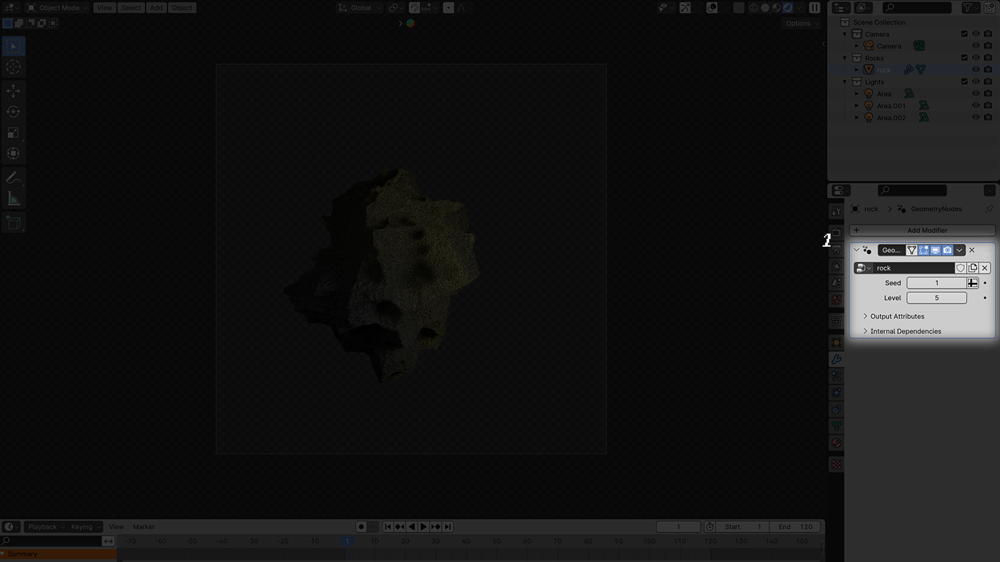
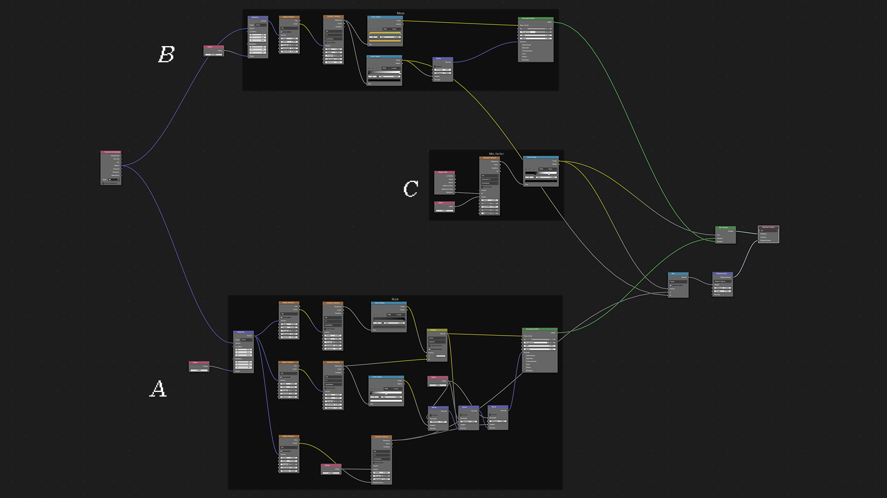

# le rocce fluttuano nell'aria con una grazia surreale
a Blender file containing an asset to generate and shade a procedural rock developed by [caroljpeg](https://www.instagram.com/carol.jpegg/) for [benedetta](https://www.instagram.com/benni.a.ma/).
  
## how to get started
first of all, download and open the rocce.blend file in the *assets* directory

### the *layout* workspace

1. in the modifiers panel, it is possible to have a quick access to the two main values influencing the geometry of the mesh.
   * the seed parameter alters the values of the three extrusions that shape the rock model
   * the level parameter defines the steps of subdivision (the lower, the smoother)  
   *further customisations may be done in the 'geometry nodes' workspace*
  
### the *shading* workspace

the *shading* workspace is divided into three main areas: rock (A), moss (B) and mix factor (C)  
  
2. the *scale* value of the *mapping* defines the scale of the procedural rock texture applied on the mesh  
3. the *scale* value of the *voronoi texture* defines the scale of the displecement texture applied on the mesh  
4. the *color ramp* node defines the color palette used on the rock texture
  

  
5. the *scale* value of the *mapping* defines the scale of the procedural moss texture applied on the mesh
6. the *color ramp* node defines the color palette used on the moss texture
  

7. the *scale* value of the *voronoi texture* defines the scale of the procedural texture used as a mask for the mossy areas

  
- - - -
  
# book  

- - - -
  
13 gennaio 2024  
andrea martinelli  
  
a benedetta  
anna maria  
ricciardi,  
  
alle rocce,  
alle metafore  

